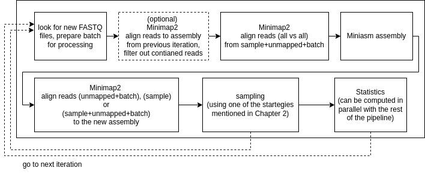

## Dynamic assembly pipeline

This repository contains the source code for my diploma thesis. 

The pipeline iteratively processes the data as they are produced during the sequencing run. In each iteration, we process a new set of reads (batch) from the run, and we use the new information we have from them for the assembly along with a selection of reads (sample) from the previous iterations.

The goal is to provide the user with real-time information about whether there is enough data from the sequencing run for the genome assembly.

The pipeline maintains a representative sample from the available data during the nanopore sequencing run and assembles the reads, providing the user with real-time results.

Here is a simplified overview of one iteration of the pipeline:


### dependencies
To run the pipeline, you need the `pysam` python library, minimap2 installed and compiled miniasm sorce code from this repository.

### run:
run with default settings:
```
cd python
python3 main.py -i /path/to/input/directory/with/reads/ -o /where/to/write/output/ -bd /path/to/this/repository/
```

### options:
The pipeline options:
```
usage: main.py [-h] -i IN_DIR -o OUT_DIR -bd BASE_DIR [-s SUBSAMPLE_STRATEGY] [-v {A,B,C}]
               [-t COVERAGE_THRESHOLD] [-l MAPPING_LOOPS] [-us] [-plr] [-e MAX_LOOPS]
               [-w MAX_WAITING_COUNT] [-wt WAIT_TIME] [-b BATCH_SIZE] [-mt MINIMAP_THREADS]
               [-mk MINIMAP_K] [-mmur MINIASM_MIN_UNITIG_READS] [-mmc MINIASM_MIN_COVERAGE]
               [-trfa TRACK_FINALASSEMBLY] [--have_assembly] [--min_disk_space]

dynamic assembly pipeline

options:
  -h, --help            show this help message and exit
  -i IN_DIR, --in_dir IN_DIR
                        input dir (where are the reads from the run), should end with /
  -o OUT_DIR, --out_dir OUT_DIR
                        where will be the files created by the pipeline (should end with /)
  -bd BASE_DIR, --base_dir BASE_DIR
                        base directory (repository root) (should end with /)
  -s SUBSAMPLE_STRATEGY, --subsample_strategy SUBSAMPLE_STRATEGY
                        subsample strategy - probabilistic/take_all
  -v {A,B,C}, --pipeline_version {A,B,C}
                        pipeline version: A (probabilistic subsampling in each step, append to
                        subample) / B ("unbiased subample", rewrite subsample in each iteration) /
                        C (version with map-to-assembly loop)
  -t COVERAGE_THRESHOLD, --coverage_threshold COVERAGE_THRESHOLD
                        subsampling covarage threshold
  -l MAPPING_LOOPS, --mapping_loops MAPPING_LOOPS
                        num of map-to-assembly lopps before new assebly is created (ignored in A,
                        B pipeline versions)
  -us, --unbiased_simple
                        unbiased subsampling (ignered in A,C pipeline versions)
  -plr, --prefer_longer_reads
                        biased subsampling, strongly prefering longer reads (ignered in A,C
                        pipeline versions)
  -e MAX_LOOPS, --max_loops MAX_LOOPS
                        maximal number of runs of main (mapping+assmbly) loop - program will end
                        after max_loops iterations
  -w MAX_WAITING_COUNT, --max_waiting_count MAX_WAITING_COUNT
                        the program will end after max_waiting_count*wait_time of time if no new
                        files present
  -wt WAIT_TIME, --wait_time WAIT_TIME
                        interval in which we check whether new files are present, if no new files
                        seen at the start of the pipeline iteration
  -b BATCH_SIZE, --batch_size BATCH_SIZE
                        max number of files to be processed at once
  -mt MINIMAP_THREADS, --minimap_threads MINIMAP_THREADS
                        num of minimap threads
  -mk MINIMAP_K, --minimap_K MINIMAP_K
                        minimap K parameter (number of bases loaded into memory to process in a
                        mini-batch)
  -mmur MINIASM_MIN_UNITIG_READS, --miniasm_min_unitig_reads MINIASM_MIN_UNITIG_READS
                        min reads needed for unitig in miniasm
  -mmc MINIASM_MIN_COVERAGE, --miniasm_min_coverage MINIASM_MIN_COVERAGE
                        minasm coverage threshold for read filtering
  -trfa TRACK_FINALASSEMBLY, --track_finalassembly TRACK_FINALASSEMBLY
                        final (correct) assembly
  --have_assembly       we have a reference..
  --min_disk_space      remove all non-essential files at the end of pipeline run
```


How to run the pipeline versions as they are labeled in my diploma thesis:

version A:
```
python3 main.py -i /path/to/input/directory/with/reads/ -o /where/to/write/output/ -bd /path/to/this/repository/ --pipeline_version A --batch_size 10 --coverage_threshold 30 --track_finalassembly /path/to/assembly/ie/sapIngB1.fa  --have_assembly
```

version A-map:
```
python3 main.py -i /path/to/input/directory/with/reads/ -o /where/to/write/output/ -bd /path/to/this/repository/ --pipeline_version C --mapping_loops 1 --batch_size 10 --coverage_threshold 30 --track_finalassembly /path/to/assembly/ie/sapIngB1.fa  --have_assembly
```

version B-u:
```
python3 main.py -i /path/to/input/directory/with/reads/ -o /where/to/write/output/ -bd /path/to/this/repository/ --pipeline_version B --unbiased_simple --batch_size 10 --coverage_threshold 30 --track_finalassembly /path/to/assembly/ie/sapIngB1.fa  --have_assembly
```

version B-c:
```
python3 main.py -i /path/to/input/directory/with/reads/ -o /where/to/write/output/ -bd /path/to/this/repository/ --pipeline_version B --batch_size 10 --coverage_threshold 30 --track_finalassembly /path/to/assembly/ie/sapIngB1.fa  --have_assembly
```

version D-u:
```
python3 main.py -i /path/to/input/directory/with/reads/ -o /where/to/write/output/ -bd /path/to/this/repository/ --pipeline_version B --unbiased_simple --prefer_longer_reads --batch_size 10 --coverage_threshold 30 --track_finalassembly /path/to/assembly/ie/sapIngB1.fa  --have_assembly
```

version D-c:
```
python3 main.py -i /path/to/input/directory/with/reads/ -o /where/to/write/output/ -bd /path/to/this/repository/ --pipeline_version B --prefer_longer_reads --batch_size 10 --coverage_threshold 30 --track_finalassembly /path/to/assembly/ie/sapIngB1.fa  --have_assembly
```
